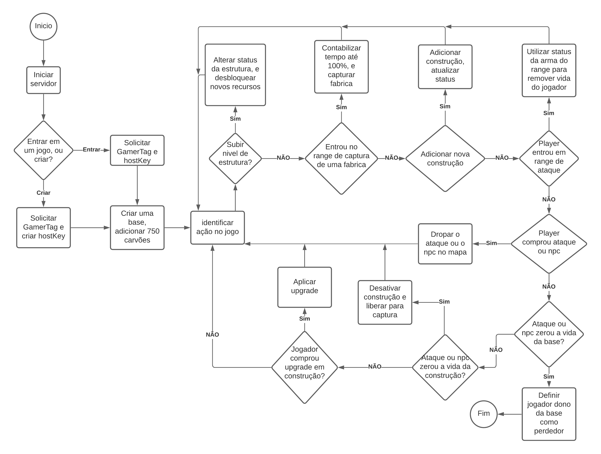

# War Base

War Base é um jogo multiplayer FFA (free-for-all) de bases. Cada jogador administra uma base, constrói estruturas, captura fábricas, pesquisa tecnologias, envia unidades e tenta ser o último com a base ativa.



## Como Rodar

Requisitos:

- Node.js 20 ou superior
- npm 10 ou superior

Instale as dependências:

```bash
npm install
```

Inicie em desenvolvimento, com reload automático:

```bash
npm run dev
```

Ou rode como produção local:

```bash
npm start
```

Acesse a partida em `http://localhost:4000`. O servidor usa a porta `4000` por padrão, mas aceita a variável `PORT` para outros ambientes, por exemplo `PORT=3000 npm start`.

O endpoint `GET /health` retorna `status`, `activeRooms`, `uptimeSeconds` e `timestamp`, e pode ser usado por checks de disponibilidade. Ao receber `SIGINT` ou `SIGTERM`, o servidor encerra Socket.IO e o servidor HTTP antes de finalizar.

## Como Entrar

- **Criar partida**: informe um GamerTag e o servidor gera uma HostKey de sala privada.
- **Entrar em partida**: informe GamerTag e uma HostKey existente. A HostKey é normalizada para 5 caracteres alfanuméricos.
- Também é possível pré-preencher a sala pela URL com `?sala=ABCDE`.
- O navegador lembra o último GamerTag usado para agilizar novas partidas no mesmo dispositivo.
- Cada jogador começa com uma Base e 750 carvões.

## Inteligência Artificial

O jogo pode adicionar uma IA pela lista de jogadores no HUD, usando o botão **Adicionar IA**. O servidor cria um jogador interno e usa o agente composto em `ai/agente-composto/`, que combina um roteador estrategista com sub-redes especializadas para capturar, construir, pesquisar, defender, atacar, evoluir estruturas e explorar sob fog of war.

A estratégia adotada está documentada em [docs/estrategia-ia.md](docs/estrategia-ia.md).

A implementação fica separada em duas partes:

- `ai/rede-neural/`: matriz e rede neural feedforward com backpropagation.
- `ai/agente-composto/`: agente hierárquico, codificação espacial, validadores, datasets e pipeline de treino.

Para regenerar as redes treinadas em `ai/agente-composto/redes/`:

```bash
npm run train:ai
```

## Objetivo

Proteja sua Base. Quando a integridade de uma Base chega a 0, o dono é eliminado e todas as suas estruturas/unidades saem do jogo. Quando sobra apenas um jogador com Base ativa, ele vence.

## Gameplay Atual

O jogador não é mais controlado diretamente por WASD como uma entidade no mapa. O jogador funciona como comandante da Base: seleciona terrenos/construções e emite ordens.

Para capturar uma fábrica neutra ou desativada:

1. Clique em uma construção capturável.
2. Use o botão **Iniciar captura** ou o atalho `D`.
3. A Base envia automaticamente um **Capturador**.
4. O Capturador caminha sozinho até o alvo.
5. Ao entrar no alcance de captura, ele começa a capturar.
6. Se outro Capturador estiver influenciando a captura, eles podem se atacar.
7. Após 30 segundos de progresso, a construção muda de dono e é reativada.

Se o Capturador morrer, ele fica fora por 30 segundos e reaparece perto da Base.

## Atalhos

- `W`: upar a construção selecionada.
- `A`: construir Cover no terreno selecionado.
- `S`: enviar Zunim, se Tujai estiver ativa e houver carvão.
- `D`: iniciar captura do alvo capturável; se não houver alvo capturável selecionado, foca a Base.
- `Esc`: limpa a seleção.
- Clique no mapa: seleciona terreno ou construção.
- O HUD mostra recursos, estado da unidade, estruturas ativas, unidades em campo, jogadores offline e horário dos eventos.

## Loop Do Servidor

A cada tick, o servidor processa:

1. Respawns de Capturadores que morreram e já cumpriram 30 segundos.
2. Geração de recursos por estruturas ativas.
3. Regeneração de barreiras de estruturas e unidades fora de combate.
4. Ordens dos Capturadores, incluindo movimento, ataque e aproximação para captura.
5. Progresso de captura de estruturas desativadas.
6. Ataques automáticos de torres.
7. Movimento/ataque de NPCs ofensivos, como Zunim.
8. Condição de vitória.

## Recursos

- **Carvão**: recurso principal. Usado para construir, comprar NPCs e fazer upgrades. Gerado por Cover.
- **Conhecimento**: recurso de tecnologia. Gerado por Taraque. Usado para pesquisar Per, Hef e Tujai.

## Combate

- Barreira absorve dano primeiro; depois o dano vai para integridade.
- Barreira regenera quando a entidade não recebe dano por alguns segundos.
- Torres atacam automaticamente inimigos no alcance a cada 1 segundo.
- Estruturas comuns zeradas ficam desativadas e capturáveis.
- Bases zeradas eliminam o jogador.

## Captura

- Só estruturas marcadas como capturáveis podem receber ordem de captura.
- A Base não é capturável; ela deve ser destruída.
- O Capturador tem 160 de integridade, 40 de barreira, 20 de dano e 1.5 de alcance.
- O Capturador nasce perto da Base, anda 1 campo por tick e captura quando fica dentro do alcance.
- Capturadores inimigos próximos ao mesmo ponto disputado podem lutar entre si.
- A captura leva 30 segundos de progresso.

## Construções

Cada tipo construível tem limite atrelado ao nível da Base. O limite usa `base + slope * (nivelDaBase - 1)`: Cover começa em 3 slots e ganha +2 por nível; Taraque, Per, Hef e Tujai começam em 1 slot e ganham +1 por nível. Estruturas próprias desativadas não contam para o limite, enquanto capturas podem deixar o jogador acima do cap e bloquear novas construções daquele tipo até abrir espaço ou subir a Base.

Estruturas que não são a Base só podem receber upgrade até o nível atual da Base. A Base não tem esse teto e é o eixo para liberar mais slots e níveis.

O upgrade da Base também depende de um gate de progressão: a média de níveis das demais estruturas próprias ativas precisa alcançar `nivelAtualDaBase × 0.75` para que o botão de upgrade libere. Por exemplo, para subir do nível 4 para o 5 a média precisa ser ≥ 3; para subir de 100 para 101, ≥ 75. Estruturas desativadas próprias não entram na conta; capturas entram.

### Base

- 1000 de integridade inicial.
- 500 de barreira inicial.
- +25 de integridade e +25 de barreira por nível.
- Base nível 2 desbloqueia Taraque.
- Não é capturável.

### Cover

- Custa 540 carvões.
- Gera carvão automaticamente.
- Começa em +20 carvões por segundo.
- +5 carvões por segundo por nível.
- Capturável quando desativada/neutra.

### Taraque

- Exige Base nível 2.
- Gera conhecimento.
- Permite pesquisas:
  - Nível 1: Per e Hef.
  - Nível 2: Tujai.

### Per

- Torre de dano único.
- Custa 140 carvões.
- 500 de integridade.
- 0 de barreira.
- 5 de dano por tiro.
- 20 de alcance.

### Hef

- Torre de dano em área.
- Custa 200 carvões.
- 200 de integridade.
- 100 de barreira.
- 15 de dano por tiro.
- 10 de alcance.

### Tujai

- Fábrica de NPCs ofensivos.
- Custa 600 carvões.
- 200 de integridade.
- 0 de barreira.
- Permite enviar Zunim depois da pesquisa Tujai.

## Unidades

### Capturador

- Unidade automática enviada pela Base ao iniciar captura.
- Custo 0.
- 160 de integridade.
- 40 de barreira.
- 20 de dano.
- 1.5 de alcance.
- Reaparece na Base 30 segundos após morrer.

### Zunim

- Unidade ofensiva comprada pela Tujai.
- Custa 80 carvões.
- 150 de integridade.
- 50 de barreira.
- 10 de dano.
- 1 de alcance.
- Anda sozinho até a Base inimiga mais próxima.
- Ganha +10 de integridade, +5 de barreira e +2 de dano por nível da Tujai.

## Desenvolvimento

Arquivos principais:

- `server.js`: servidor Express + Socket.IO.
- `public/game.js`: estado, regras e simulação do jogo.
- `public/render-screen.js`: renderização do canvas e HUD.
- `public/index.html`: layout, estilos e handlers de UI.
- `ai/rede-neural/`: implementação da rede neural.
- `ai/agente-composto/`: agente composto, codificadores, validadores e treinamento.

Comandos úteis:

```bash
npm run dev
npm start
npm run train:ai
npm test
npm run coverage
npm run test:watch
```

O comando `npm run coverage` exige 100% em statements, branches, functions e lines para todo o projeto.
